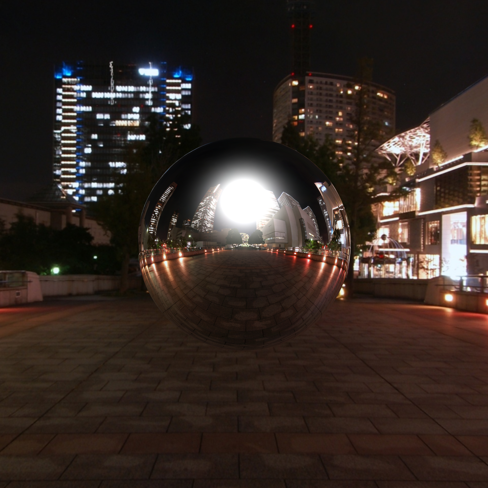
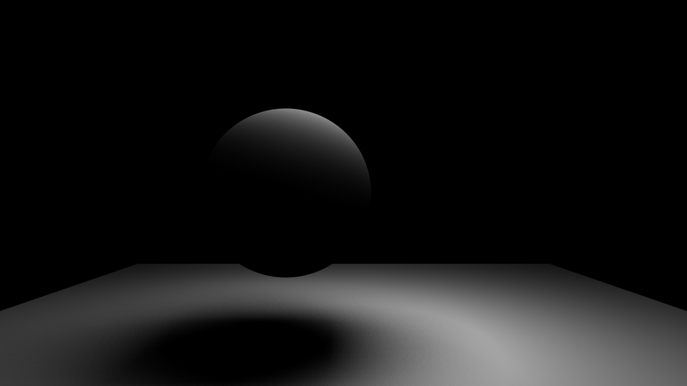
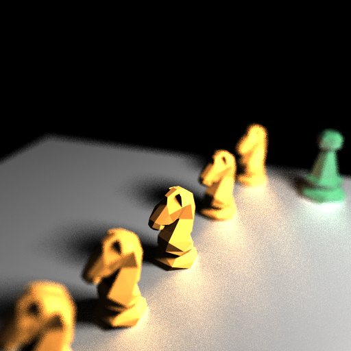

## Trace

Who worked on this project?

> Kyle Yan (kyleyan) and David Chen (hanfec).

What operating system did you develop on?

> Windows 10.

How did you split work amongst partners (if any) in this project?

> Kyle worked on intersections, part of ray tracing (shadow rays), and bells and whistles.
> David worked on ray tracing (shading, reflection, refraction).

## Bells and Whistles

Which bells and whistles did you attempt to do, which did you complete?

> **Completed**
>
> * (1x Whistle) Uniform random sampling
> * (1x Whistle) Stratified random sampling
> * (2x Bell) Environment mapping (cubemaps)
> * (4x Bell) Monte Carlo path tracing
>   - (2x Bell) Depth of field
>   - (2x Whistle) Soft shadows
>   - (2x Whistle) Glossy reflection
>
> **Some rendered images**
>
> Cubemap
>
> 
>
> Soft shadows
>
> 
>
> Soft shadows, glossy reflection, depth of field
>
> 

Was there anything out of the ordinary that we should know about?

> None.

## Feedback

About how long did you and your partners (if any) spend on this project?

> ~14 hours each.

What was the hardest part about this project?

> Figuring out how shadow ray works.
>
> For the extra credit requirements, we had a LOT of trouble figuring out how to render
> area lights (and didn't figure that out :( ).

Is there anything you would change about this project?

> It would be nice if we had a standard for tolerable diff error.
> Worrying about tiny errors that we could probably never fix is a huge pain.
